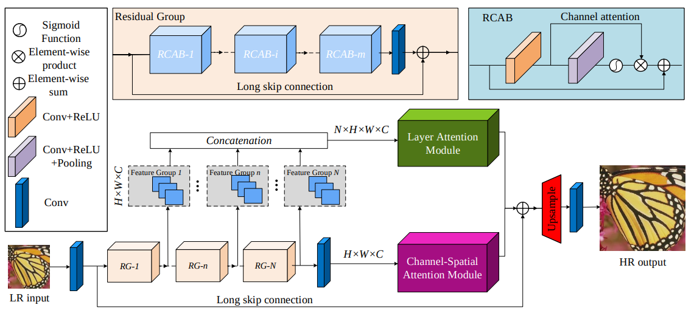
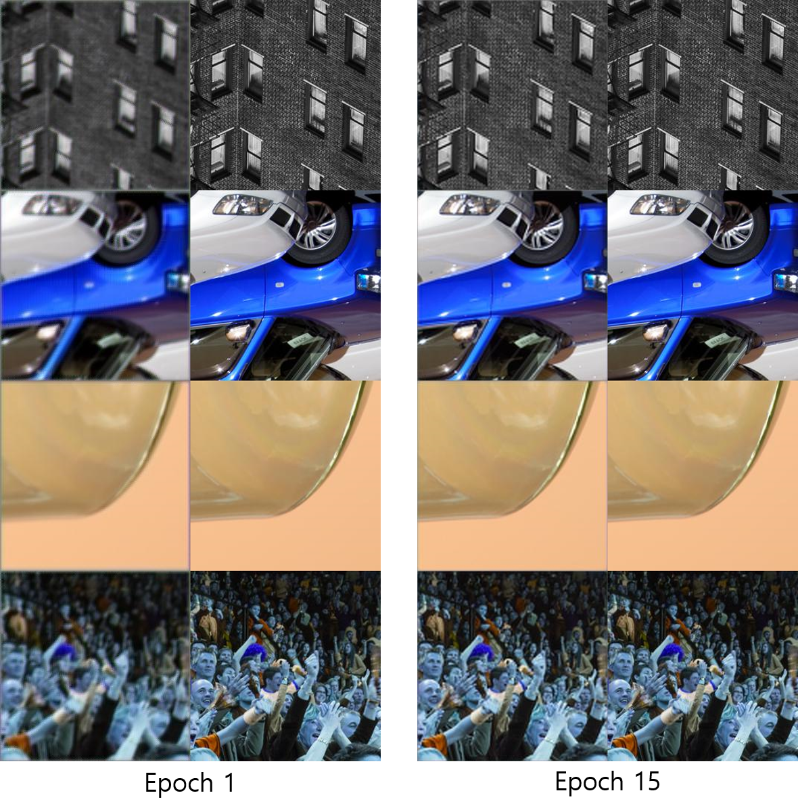

# Single_Image_SuperResolution_via_Holistic_Attention_Network

This repository implements the paper ["Single Image Super-Resolution via a Holistic Attention Network"](https://arxiv.org/pdf/2008.08767.pdf) published in ECCV2020.

## Requirements
* python3.6+
* pytorch 1.6.0
* others.

## Usage
training a model
```bash
python3 main.py --config config_patch.yml
```

testing a model
```bash
Not implmented yet
```

## Architecture

## Results
### Patch Results

### Image Results


## Comments
 In this implementation, a light model is used; 5 residual_groups and residual blocks. The input of high resolution images generated from the model are half size. Hyper-parameter tuning is need to get better results. If you have questions, Please leave an issue. Image based training is impossible in terms of memory. 
## Reference
1. Dataset : https://data.vision.ee.ethz.ch/cvl/DIV2K/
2. RCAN : https://github.com/yulunzhang/RCAN